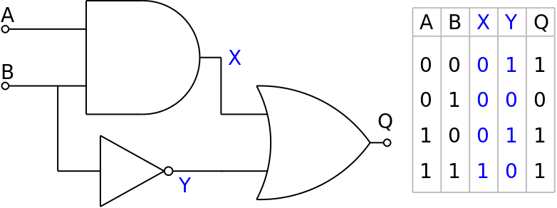

# Circom Circuit verify

An overview of a unique zero-knowledge circuit built with the Circom programming language is given here. The circuit illustrates how to make logic gates and how to connect them to make a custom computation. The resulting circuit preserves the privacy of the input data and can be used to produce zero-knowledge proofs for certain computations.

### Contract Address
> [0x20a31686f84Fc9Da04175d7474a68Be0Ff9a699D](https://mumbai.polygonscan.com/address/0x20a31686f84Fc9Da04175d7474a68Be0Ff9a699D)

## Quick Start
Compile the Multiplier2() circuit and verify it against a smart contract verifier

```
component main = Multiplier2();
```
### Install
`npm i`

### Compile
`npx hardhat circom` 
This will generate the **out** file with circuit intermediaries and geneate the **MultiplierVerifier.sol** contract

### Prove and Deploy
`npx hardhat run scripts/deploy.ts`
This script does 4 things  
1. Deploys the MultiplierVerifier.sol contract
2. Generates a proof from circuit intermediaries with `generateProof()`
3. Generates calldata with `generateCallData()`
4. Calls `verifyProof()` on the verifier contract with calldata

With two commands you can compile a ZKP, generate a proof, deploy a verifier, and verify the proof 

### Understanding the circuit 
-  Two input signals, A and B, are used by the circuit as operands during computation.
-  Three logic gates are used in the circuit: AND, NOT, and OR. The definitions of these gates are distinct templates.
-  Intermediate Signals: The AND and NOT gates' respective outputs,  X and Y, are the two intermediate signals in the circuit.
-  Output: Using inputs from the intermediate signals, the OR gate computes the final output signal, Q.

### `AND`, `NOT`, and `OR`

These templates define the logic for the `AND`, `NOT`, and `OR` gates, respectively. Each gate takes input signals and produces an output signal based on the defined logic.

 ### Deploying on Mumbai Tesnet POLYGON 
   ```
   npx hardhat run scripts/deploy.ts --network mumbai
   ```
   This script performs the following tasks:
   - Deploys the verifier contract.
   - Generates a proof using circuit intermediaries.
   - Generates calldata for verification.
   - Calls `verifyProof()` on the verifier contract with calldata for proof verification.

## Authors

- Jayanth A
- CSE CORE

## License

This project is licensed under the MIT License - see the LICENSE.md file for details